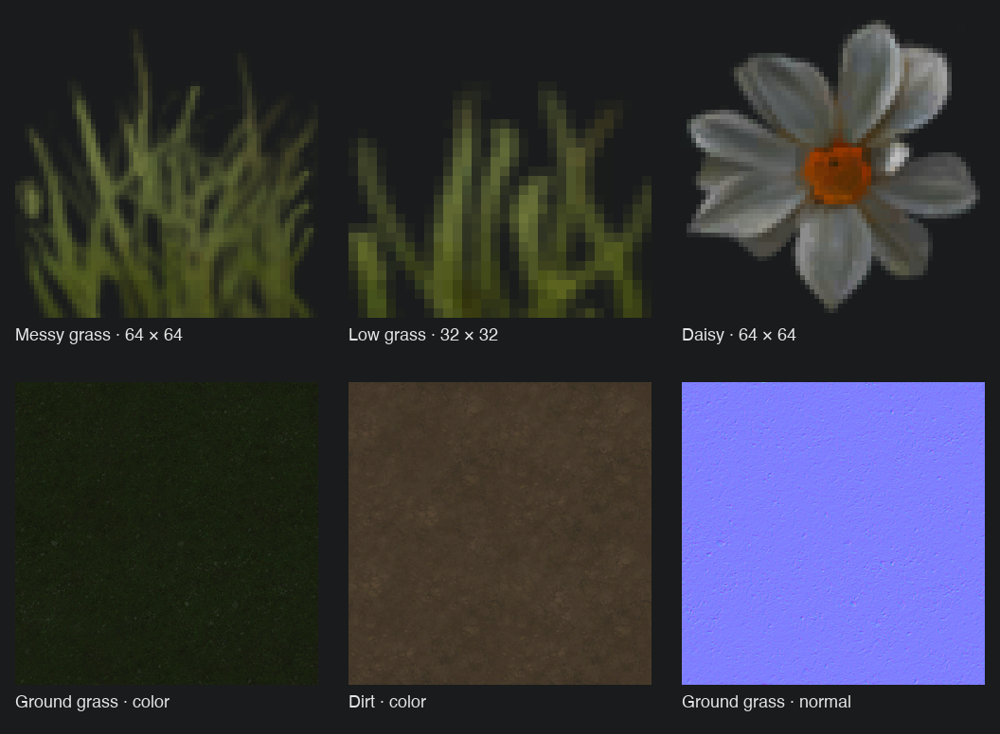

# The Scouring terrain / grass inspection

Inspected 2026-09-19 for our active terrain testbed. Source: user-provided ShaderCache.sdc, Media/classes, TextureCache and MeshCache from The Scouring. Source files were inspected as data; the game executable was not run. This is an implementation inspection, not a runtime benchmark.

The first row preserves source alpha and enlarges pixels with nearest filtering. The second row shows RGB only; its alpha channels store material data, not transparency. Ground textures are reduced from 1024² for this sheet.

## Confirmed findings

- `Media/classes/terraintypes/grass.xml` supplies `TextureAlbedoRoughness`, `TextureNormalHeight`, a tiling scale of .25, and `BlendHeightRange=.5`. Dirt uses .2 tiling. `Terrain.fx::BlendLayers` blends by texture height or a sharpened alpha mask. This gives irregular material boundaries instead of a simple smooth interpolation.
- Terrain layer textures are 1024×1024, BC7_UNORM (DXGI 98), with nine stored mip levels. Messy grass / high grass / daisies use 64×64 BC7 with five stored mips; low grass uses 32×32 with four. These are properties of the supplied cache, not assumed source artwork resolutions.
- Terrain packs albedo RGB + roughness alpha and normal RGB + height alpha into two textures per material. Array textures hold the material library.
- `Shared.fxh` declares 16-unit terrain blocks, four subblocks per axis (4-unit subblocks), and at most six material-layer indices per subblock. `GetTerrainLayersColor` samples the base and additional nonzero layer slots. It does not iterate through every terrain material globally.
- `Terrain.fx` contains distance-adaptive hardware tessellation, clamped to factors 2–32, and a low-quality factor of 1. Height textures drive small displacements as well as shading. This source path does not prove which quality setting produced the screenshot.
- `ApplyMacroColor` applies one shared world-space color texture at .01 scale to terrain and grass. The grass mesh material enables `IsUseGroundColor`: its surface color is multiplied by sampled ground RGB × 2. The source warns of imperfections with per-vertex lighting, so exact results depend on that pipeline.
- `MeshCache/grass_grass_messy` and `grass_grass_low` contain `IsAlphaKill=true`, `IsTwoSided=true`, and a `GrassMaterial`. Both decoded records have 18 vertices, a 28-byte vertex stride and 10 triangles. The inferred record layout was checked against valid 16-bit indices 0–17 and matching stored/decoded bounds. This validates these two files; it is not a general MeshCache parser. The meshes carry blade-clump imagery rather than modeling every visible blade.
- `Grass.fxs` reconstructs placement from packed block/local coordinates, orientation and scale. It samples terrain height and a partly upright terrain normal on the GPU. Wind and trampling/bending operate in the vertex shader through shared textures. Individual grass objects do not require per-frame CPU transforms for those effects.
- Grass explicitly defines `PERVERTEX_LIGHTING` and `PERVERTEX_FOG`. The shared base shader still samples shadows in the pixel shader; this is not wholly vertex-only shading. Grass normals are deliberately reshaped into a soft upward-biased clump rather than using the flat mesh normals.
- Grass placement classes specify a shared planting group, minimum spacing .2 and optional scale masks. Grass terrain requests the `GrassMessy` auto-brush; dirt/soil request no grass. Underlay masks remove grass under authored surface overlays. These settings show coordination between terrain and planting, but not the complete CPU placement algorithm.
- The distance-fade / early-clip code visible in `Grass.fxs` is commented out. Do not present it as an active optimization. CPU culling, draw-call counts and actual screen overdraw remain unmeasured.

## Comparison with our current implementation

Our `canopy-short-grass/model.glb` contains 102 triangles per authored clump, with whole-blade thinning LODs. `forestGrassGeometry` bakes vertex colors and keeps explicit blade geometry. Our meadow renderer already instances material batches in 16×16 spatial cells, uses GPU wind, frustum culling, and simpler Lambert materials. Those systems are present; they are not the primary missing idea.

Our terrain shader mixes numerous procedural noises and color textures, derives some relief from color intensity, and blends paint mostly by smooth masks. The reference instead has purpose-authored material channels, height-aware transitions, coordinated ground/grass coloration, and inexpensive textured clump silhouettes. The reference's 10-triangle clump has about one tenth the geometry of our full-detail clump, but alpha cutouts increase fragment work and plant size/coverage differ. This is not evidence of a tenfold frame-rate gain.

## Suggested testbed sequence

1. Reproduce dirt and grass material channels and their height-aware blend on Texture Test 1.
2. Add the supplied small cutout clumps with soft clump normals and terrain-matched color. Retain our existing batching/chunking infrastructure.
3. Tune coverage, scale and macro color against the same fixed reference camera; preserve open soil and irregular fringes.
4. Measure foliage triangles, shadow/reflection participation, GPU time and overdraw before increasing density. Close cameras may need richer meshes while the RTS camera uses these cheaper clumps.

No game rendering code or maps were changed by this inspection.
