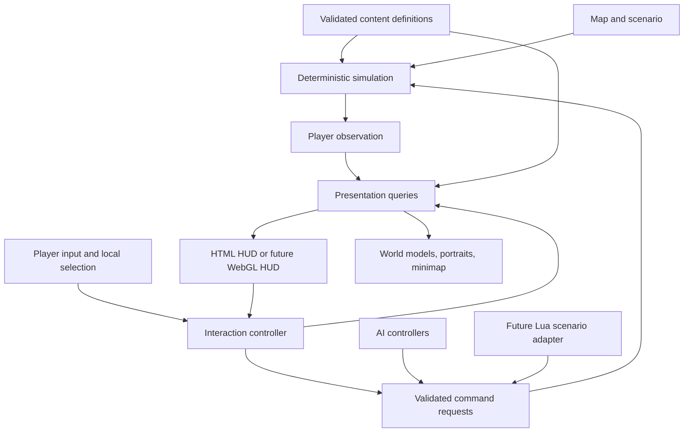

# Under the Canopy: declaration-driven architecture

**Status:** Historical first discussion, superseded by [the rebuild specification](</Users/jiritrecak/Documents/Supernova/Development/Settlers 3 Web/declaration-rebuild-spec.md>) and [production/work specification](</Users/jiritrecak/Documents/Supernova/Development/Settlers 3 Web/production-and-work-spec.md>). Do not implement the migration, authoring, or scope choices below where they differ from those documents.  
**Date:** 8 September 2026.  
**Starting point:** The current TypeScript simulation, HTML HUD, Three.js renderer, map editor, and multiplayer lockstep.  
**Objective:** Make content expandable through declarations and composition, make the interface a projection of that content and game state, and establish a safe boundary for future Lua scenarios.

## 1. The recommendation

Build a **declaration-driven game with a small set of explicit, deterministic systems**.

A definition describes what an entity is, which behaviors it has, and how it is presented. Runtime state records what has happened to that particular entity. Systems implement movement, combat, logistics, construction, and other algorithms. The interface receives a player-specific description derived from definitions and state, and sends commands back through a validated boundary.

This should let us add another warrior, recruitment recipe, neutral creature, item, or faction variant without editing the HUD, network protocol, and renderer for each one. A genuinely new mechanic, such as burrowing, still requires a new system. Declarations compose implemented mechanics; they do not eliminate the need to implement mechanics.

The major categories are:

1. **Content definitions:** entities, behaviors, commands, recipes, items, effects, faction rules, and presentation assets.
2. **Runtime simulation:** entity instances, capabilities, orders, jobs, inventories, combat, and world services.
3. **Observation and interaction:** what a player knows, selection, targeting, availability, and command dispatch.
4. **Presentation:** world models, live portraits, selection panels, command cards, minimap, and tooltips.
5. **Maps and scenarios:** placements, camps, regions, starting conditions, objectives, and future Lua hooks.
6. **Content tooling and compatibility:** validation, debugging, revisions, saves, replays, and migration.

The dividing line is simple: declarations describe capabilities, values, policies, and connections; tested code implements their algorithms; state records their execution. We should make ordinary content additions cheap without making novel mechanics hard to debug.

**The most valuable boundary is between the game model and presentation.** HTML and WebGL should be interchangeable consumers of the presentation contract. Lua and player input should be different authorized producers of simulation requests.

### Read this first

For our first discussion, read sections 2–5, 7–8, and 12. Sections 6, 9–11, and 13–17 describe the contracts and migration details that make those ideas workable.

All types, definitions, APIs, and folder names shown below are proposed. Examples are abbreviated to emphasize their contracts, not code that already exists.

## 2. Work backwards from the interface

When I select a barracks, the interface needs to know:

- Its name, owner, current/max HP, armor, construction state, and inspectable status.
- Which model to render in the portrait, with which player color and portrait camera preset.
- Which commands it supplies and where those commands belong.
- The warrior recipe's cost, duration, requirements, and explanation.
- Whether recruitment can be queued now, whether a queued recruit can start, and why it is waiting.
- Queue entries with stable identities, progress, and cancellation actions.

The renderer should not need to know that its entity is specifically a barracks. It should receive a `SelectionPanelView` containing a portrait, statistics, a queue, and a command card. The recruitment system supplies the relevant status; the presenter formats it into those modules.

Selecting an item should work through the same inspection path. It may have a name, a model, a stack quantity, and a description without HP, a recruitment queue, or movement commands. Selecting a hero adds progression and inventory sections only if those capabilities exist.



Three separate meanings of “state” matter here:

- **Simulation state:** HP, position, orders, cargo, inventory, cooldowns, ownership, and scenario progress. Shared and deterministic.
- **Knowledge state:** exploration and last observed information for each player. Updated by the simulation's visibility rules, persisted for correct restoration.
- **Local interface state:** selected IDs, focused subgroup, targeting mode, open command page, tooltip, camera, and keybindings. Local; never part of multiplayer commands unless translated into an actual order.

The HUD consumes knowledge, not an unrestricted simulation object. Even the minimap and live portrait must obey that boundary.

## 3. What we already have, and what is coupled

The current implementation has useful foundations worth preserving:

- A fixed 25 ms simulation tick, ordered player actions, checksums, and lockstep transport.
- Shared building/unit balance constants.
- Physical carriers, material reservations, construction, and recruitment that converts a real settler.
- Group selection, deterministic movement destinations, attack-move, and explicit friendly fire.
- Three-state fog, remembered buildings/resources, and observed **real** territory borders.
- Map authoring, neutral placements, player colors, asset loading, and graphics diagnostics.

The main problem is that content identity still drives decisions in many places:

- `rules.ts` contains some balance values, but vision, work timings, targeting, and job rules also live elsewhere.
- `Worker.role` combines species, military identity, profession, and dispatch to different algorithms. A wolf is currently a kind of `Worker`.
- `SettlementHud` constructs commands, handles hotkeys/targeting flags, chooses portraits, and derives economy status.
- `Session.click` recognizes soldier roles and building kinds to choose actions.
- `SettlementLayer` has a separate model lookup and role-specific presentation decisions.
- Map asset names imply resources and neutral unit types. Changing art identity can therefore change gameplay identity.
- “Wood” means planks in one ledger, while logs and planks are distinct elsewhere.

There is also an authority gap to close deliberately: selecting a settler currently exposes construction in the HUD, but the `build` action has no issuing entity and is authorized at colony level. A future declaration that says “this unit can build” must be checked by the simulation, not merely used to show a button.

Existing save-envelope types and visibility snapshot methods provide pieces of persistence. They should not be treated as proof that complete settlement save/restore is already implemented; that needs an explicit round-trip milestone.

### Source anchors reviewed

- [Gameplay definitions](</Users/jiritrecak/Documents/Supernova/Development/Settlers 3 Web/src/shared/settlement/rules.ts>)
- [Simulation and jobs](</Users/jiritrecak/Documents/Supernova/Development/Settlers 3 Web/src/sim/settlement/settlement.ts>)
- [Action validation](</Users/jiritrecak/Documents/Supernova/Development/Settlers 3 Web/src/shared/types/types.ts>)
- [Tick and command ordering](</Users/jiritrecak/Documents/Supernova/Development/Settlers 3 Web/src/sim/world/world.ts>)
- [Current HUD](</Users/jiritrecak/Documents/Supernova/Development/Settlers 3 Web/src/ui/settlement/settlementHud.ts>)
- [Input interpretation](</Users/jiritrecak/Documents/Supernova/Development/Settlers 3 Web/src/session/session/session.ts>)
- [Visibility and memory](</Users/jiritrecak/Documents/Supernova/Development/Settlers 3 Web/src/sim/visibility/visibility.ts>)
- [Map schema](</Users/jiritrecak/Documents/Supernova/Development/Settlers 3 Web/src/shared/map/utcmap.ts>)
- [Save envelope](</Users/jiritrecak/Documents/Supernova/Development/Settlers 3 Web/src/shared/save/save.ts>)

## 4. Definitions, instances, behaviors, and systems

### 4.1 Definitions are immutable content

Every gameplay definition has a stable namespaced ID: `ants.unit.warrior`, `ants.building.barracks`, `neutral.unit.wolf`, `core.item.plank`.

Names, file paths, array positions, and translated text are not identities. A model can change without turning a unit into a different unit. An editor can rename a placed creature without changing its definition.

Definitions are shared by instances and frozen when a match begins. An upgrade or damage event never edits a global definition; it changes instance/player state or adds a modifier.

Start with typed TypeScript data literals that compile to a canonical, serializable content pack. No callbacks, Three.js objects, browser references, or closures in the exported pack. The same schema can later accept JSON from the editor. Runtime mod loading should accept validated data, not execute arbitrary TypeScript.

### 4.2 Entity instances are composition, not a class hierarchy

Use a common entity identity and lifecycle for units, buildings, interactive resources, and dropped items. Keep a `kind` classification for authoring and broad presentation, but systems operate on capabilities.

Conceptually:

```ts
type EntityRef = number; // Monotonic and not reused within one match.

type EntityState = {
  id: EntityRef;
  definitionId: DefinitionId;
  owner: OwnerRef;
  lifecycle: "alive" | "dying" | "removed";
  components: ComponentStateByType;
};
```

This is a logical contract, not a requirement to allocate a giant component dictionary for every blade of grass. Start with typed stores for the components we need; optimize their storage independently. Do not begin by building or adopting an all-purpose ECS framework.

Possible state stores include position, vitality, orders, combat, employment, cargo, storage, production queue, construction, camp membership, inventory, and hero progression. A dropped plank stack does not acquire combat timers merely because a soldier has them.

### 4.3 Behaviors are assignable capabilities with configuration

A behavior has:

- A stable ID and a validated configuration schema.
- Required capabilities and any incompatible combinations.
- The state it needs and its initialization/cleanup rules.
- Native systems that process it.
- Commands, inspection sections, and semantic presentation cues it contributes.

Examples:

- `core.locomotion`: movement profile, speed, collision/navigation participation.
- `core.direct-orders`: permits player control and exposes eligible order commands.
- `core.combat`: attack profiles, damage, cooldowns, permitted targets.
- `core.auto-acquire`: chooses enemies while idle or attack-moving.
- `core.vitality`: a health pool, maximum, damage/death policy.
- `core.workforce`: eligibility for employment, carrying, and recruitment.
- `core.construction-planner`: authorizes placing projects from a build set.
- `core.builder`: performs construction and repair jobs.
- `core.recruitment`: recipes, queue, logistics demand, recruit conversion.
- `core.camp-defender`: home anchor, aggro policy, leash, return behavior.
- `core.inventory`: slots and allowed item categories.
- `core.hero`: heroic identity and optional progression configuration.
- `core.inspectable`: inspection policy and selection classification.

**Being able to move is different from allowing the player to order movement.** A wolf can have locomotion, combat, and a camp controller without `direct-orders`. Removing `direct-orders` removes player commandability, but does not break autonomous movement or authorized scenario orders.

Execution prerequisites and input permission are checked separately: Move requires locomotion; a player-issued Move additionally requires direct orders and control rights. A permitted scenario-issued Move need not require player direct orders.

Similarly, removing `combat` removes attacking and attack commands; it does not remove movement or inspection. A root effect suppresses movement execution without erasing locomotion configuration. A stun suppresses applicable order channels, while a cinematic control lock can suppress only player input.

### 4.4 Systems remain code

Pathfinding, collision resolution, job assignment, line-of-sight rules, damage processing, and transactional inventory movement remain explicit algorithms. Their parameters are declarations.

Avoid turning the game into an interpreter for arbitrary JSON instructions. Add a native processor when a new mechanic needs one; use Lua for scenario orchestration and exceptional authored behavior, not thousands of per-frame movement callbacks.

### 4.5 Reusable presets eliminate repeated command lists

A preset is a reusable bundle of behavior configurations, not a base class.

`core.preset.ground-army` can provide vitality, locomotion, direct orders, combat, auto-acquisition, vision, an army tag, and army selection priority. A warrior supplies its balance values and attack profile; an archer supplies another attack profile. Neither declares Move, Stop, and Attack buttons again.

Compilation expands presets and validates the resulting entity. Use explicit operations for replacing a behavior config or removing a behavior; avoid silent recursive merges of arrays. Reject cyclic presets, incompatible behavior versions, duplicate attack keys, and conflicting providers. Keep provenance so the editor can answer “this command came from ground-army → direct-orders.”

Command contributions are deduplicated by semantic command ID and bound arguments. Removing one provider does not remove a command still legitimately supplied by another. Removing a required capability disables/rejects its dependent commands regardless of presentation overrides.

### 4.6 Runtime changes have ownership and cleanup

Definition edits apply to future matches. Runtime grants, suppressions, and transformations are explicit simulation operations.

Every temporary grant or modifier records its source: an item, effect, employment assignment, or scenario instance. Removing that source removes only its grants. Do not delete a shared behavior because one of two items granting it was unequipped.

On capability removal or suppression, its system must settle active state: release reservations, cancel or suspend orders, clear targets, detach subscriptions, and invalidate presentation queries. Recommended defaults: removing player control cancels player-owned orders at the next safe boundary; a temporary movement lock pauses the current movement order, while permanent locomotion removal cancels it. Committed cargo cleanup remains a system responsibility, not an abandoned order. Each override declares whether it cancels, pauses, or defers an activity. Transforming a settler into a warrior needs a named migration policy for cargo, employment, HP, identity, and orders. It must not be a generic object replacement.

## 5. Concrete entity declarations

### 5.1 Warrior and archer

An illustrative warrior definition:

```ts
{
  id: "ants.unit.warrior",
  kind: "unit",
  faction: "ants",
  presets: ["core.preset.ground-army"],
  presentation: "ants.presentation.warrior",
  stats: { maxHp: 120, armor: 0 },
  defense: { armorType: "light" },
  behaviors: {
    "core.combat": {
      attacks: [{
        id: "primary",
        damage: 12,
        damageType: "physical",
        rangeCells: 1.5,
        cooldownTicks: 32,
        delivery: "instant",
        targetFilter: "core.targets.damageable-visible"
      }]
    }
  }
}
```

The preset supplies current ground movement and vision defaults. The archer uses the same preset with 70 HP, 9 damage, seven-cell range, and a 48-tick cooldown. The *initial migration* preserves today's damage timing: arrows remain cosmetic until we explicitly introduce simulated projectiles.

The compiled definition contains all resolved values, regardless of whether they were authored locally or inherited from a preset. The content inspector should expose that complete resolved unit, including damage and movement.

### 5.2 Buildings

A building definition combines vitality, defense, footprint, placement rules, construction recipe, presentation, and its actual functions.

- A fort has storage, vision, territory influence, and a match-objective role.
- A barracks has recruitment and rally support.
- A sawmill has staffing, input/output storage, and a production recipe.
- A forester has staffing and a regrowth job provider.
- A tower has territory influence and vision. It does not acquire an attack simply because it is called a tower.

Construction costs and work belong to a recipe. Footprints and gameplay entrances belong to simulation geometry declarations. Visual model bounds must not silently determine where a building blocks movement or receives melee attacks.

Free repair is also a declared workflow: no material inputs, eligible builders, and the current repair rate of one HP per four ticks per active builder. It uses the shared vitality system; individual building kinds do not each implement healing.

The fort's defeat condition belongs to the match/scenario rules: “defeat this player when their designated main fort is destroyed.” This allows future mission exceptions without writing `if kind === fort` into universal death processing. Preserve today's immediate defeat and absence of defensive fire.

### 5.3 Heroes

A hero remains a unit. `core.hero` identifies it as heroic and can provide level/experience state when we implement progression. Heroic selection decorations and campaign identity can read that marker.

Inventory, abilities, revival, equipment, and persistence across missions are separate capabilities/policies. A hero can have no inventory; a pack animal can have an inventory without being a hero. No single `isHero` branch should unlock an undocumented collection of mechanics.

### 5.4 Neutral creatures

A wolf combines vitality, ground locomotion, combat, inspection, and camp defense. It lacks player direct-order control. Owner/relations come from its placement or camp, not the wolf's visual model.

Preserve current balance on migration: wolves 90 HP / 10 damage / eight-cell aggro; ogres 350 HP / 24 damage / ten-cell aggro. Both use an 18-cell home leash. Current camps do not heal, respawn, assist as a shared pack, or drop loot. Each can become an explicit camp policy later.

Replace the overloaded `owner: -1` convention at the domain boundary with a typed neutral owner/team. Diplomacy decides hostility; command authorization decides control; species decides neither. This supports allied campaign creatures and multiple neutral factions without hardcoded exceptions.

## 6. Stats, health pools, armor, and effects

### 6.1 Declare stats with units and rules

The stat registry should define type, unit, bounds, default, and whether a stat is modifiable. Initial examples: max HP, armor amount, attack damage, range, cooldown ticks, movement timing, vision radius, and storage capacity. Unknown stat IDs are errors.

Keep current HP in vitality state; keep base maximum in the definition. The resolved maximum includes upgrades/equipment/status effects. A future mana or shield pool uses the same bounded-pool contract with its own policies. An item without vitality is not damageable and should not display a meaningless zero-HP bar.

State transitions must specify what changing max HP does. Recommended general default: preserve current HP and clamp to the new maximum, with no free healing. Recruitment explicitly retains the current prototype's full-health conversion until we choose to rebalance it. Construction retains its staged HP growth and damage preservation.

### 6.2 Armor and damage types

Declare armor types and a damage-type/armor-type interaction matrix in the ruleset. Defense amount and defense type are different fields. Avoid baking “archers are weak against buildings” into unit-name checks.

For the first implementation, use a small documented pipeline: eligibility → base damage → outgoing modifiers → type multiplier → flat armor → incoming modifiers → shield/health → death processing. Recommended initial arithmetic: multipliers use integer basis points, each multiplication divides by 10,000 with floor rounding, armor cannot reduce damage below zero, and a positive non-immune hit has a minimum of one HP after mitigation. Explicit immunity bypasses that minimum. Validate bounds to prevent overflow. These are ruleset policies, with neutral multipliers/zero armor during migration. Healing is a separate effect, not accidental negative damage.

**Do not rebalance as part of migration.** Introduce armor fields with zero armor and neutral multipliers first. Choose the eventual armor matrix in a separate balance pass. Multiple attack profiles can later have different delivery modes, ranges, and target domains without duplicating the unit.

### 6.3 Modifiers and effects

Modifiers have stable source IDs, stacking rules, duration in ticks, and an affected stat/capability. Define additive, multiplicative, and override ordering explicitly. Ties use declared priority and stable source ID. Recompute derived stats when inputs change, not every render frame.

Effects are bounded simulation operations such as damage, heal, apply modifier, transform, spawn, transfer item, or change ownership. They are implemented by typed handlers. A status definition configures handlers and timing; it does not embed arbitrary executable strings.

Death is a single lifecycle transition with a single event. It settles jobs/cargo/reservations, removes navigation occupancy and vision contributions, and evaluates objectives. Future loot uses a declared death policy. Rendering can retain a cosmetic corpse after gameplay removal without retaining an attackable unit.

## 7. Commands and command cards

### 7.1 Separate command, order, effect, and event

- A **command** is a request: recruit a warrior, attack a target, move a group, place a building.
- An **order** is accepted ongoing intent: walk to a point, pursue a target, attack-move, perform a task.
- An **effect** applies a bounded state change: consume a plank, deal damage, spawn an entity.
- An **event** reports a completed fact: unit died, item transferred, region entered, recruit completed.

A command button is one way to request a command. A hotkey, contextual click, AI, or authorized Lua handler can request the same operation without simulating a button click.

### 7.2 Command definitions supply shared semantics

A command declaration describes:

- ID and typed argument schema.
- Required actor capabilities and allowed command sources.
- Target mode/filter, including visibility and diplomacy requirements.
- Admission requirements, queue/start requirements, and typed cost references.
- Handler ID, interruption policy, and group execution policy.
- Presentation binding: name/description keys, icon, suggested slot, hotkey action, and tooltip facts.

The handler is native code. Parameters such as a recruitment recipe reference validated content; the request never supplies its own price, damage, training time, ownership, or implementation name.

For example, `core.command.recruit` bound to `ants.recipe.train-warrior` produces one card entry. Recipe name, cost, duration, and output definition drive both the UI and simulation. Adding an allowed recipe to a building produces another entry without editing the HUD.

### 7.3 Automatic commands, intentional layout

Behaviors contribute command **bindings**; shared layouts place them.

- Locomotion plus direct orders contributes Move and Stop.
- Combat plus direct orders contributes Attack.
- A construction planner contributes a shared construction page and its allowed build recipes.
- Recruitment contributes recipe entries, queue cancellation, and rally commands.
- Inventory contributes appropriate item actions.

A command card is presentation organization, not permission. Hiding a command cannot make it illegal; showing one cannot make it legal. The capability/authority checks remain authoritative.

Use stable slots/pages with explicit overflow. Disable an unavailable command in place, rather than moving the rest of the card around. Reusable layouts handle common groups; entity presentation may intentionally override a slot, icon, or label. Compile-time validation catches collisions and conflicting hotkeys on the same page.

A larger content set can add construction/recruitment pages without coupling page navigation to gameplay orders. Back, Cancel Targeting, camera movement, and selection changes are local UI actions, not lockstep traffic.

### 7.4 Availability is a report, not a boolean

A shared query should produce facts such as:

```ts
{
  bindingId: "recruit:ants.recipe.train-warrior",
  visibility: "shown",
  availability: "enabled",
  eligibleActorIds: [104],
  cost: [{ item: "core.item.plank", quantity: 1 }],
  requirements: [{ kind: "recruit", definition: "ants.unit.settler", count: 1 }],
  readiness: "waiting-for-delivery",
  reasons: [{ code: "input-not-at-building", item: "core.item.plank" }]
}
```

This deliberately distinguishes **can queue** from **can start**. Today recruitment can be queued before a plank or a free settler is available. A declarative UI must not accidentally turn that into instant recruitment or disable the queue whenever the warehouse is empty.

Use structured reason codes and parameters for localization, tooltips, status text, and tests. The presenter formats them; simulation logic never depends on English messages. A displayed price may be fixed per recipe while available stock, reservations, and deliveries are separate facts.

Queries can reuse requirement definitions and pure evaluators, but a player-facing query runs only on allowed observations. It can report an unknown target condition rather than probing hidden entities. The command executor revalidates against authoritative state when the request's tick arrives. UI enablement is advisory.

### 7.5 Transport and authority

A future request could look like:

```ts
{
  commandId: "core.command.recruit",
  actors: [104],
  args: { recipe: "ants.recipe.train-warrior" }
}
```

The authenticated player and sequence/tick come from the transport envelope, not this payload. The executor validates argument shape, bounded sizes, content IDs, actor existence, control rights, capability, target legality, and current requirements. The allowed recipe set on the actor is checked too.

Player, AI, and scenario APIs use the same typed operations with distinct trusted contexts. A client cannot select `authority: scenario`. Lua can request scenario privileges only through host-created capabilities scoped to that map's declared entities/regions/actions.

Return structured accepted/rejected/deferred results. A command accepted into an asynchronous workflow is not a guarantee that it will complete. Queue entries and orders get stable IDs; cancellation refers to a queue-entry ID, not an index that may have shifted while the network command was in flight.

For construction, include an issuing actor authorized to plan that recipe. Builders can still perform the actual work automatically; being the planner does not mean that selected settler must personally build. This closes the current HUD-only authority gap while preserving the economic model.

## 8. Selection, input, and mixed groups

Selection is a local service outside the renderer and simulation. It owns selected references, primary entity/subgroup, and changes caused by click/drag/cards. It validates against current observations and prunes dead, hidden, transformed, or otherwise ineligible entries.

Declare selection classification and priority separately from behaviors: army above workers for drag selection; buildings/items inspectable by click; neutrals inspectable but not controllable. A renderer reports hit candidates or projected bounds; the selection service applies those policies. Adding a new soldier type must not require editing `isSoldier`.

Preserve these existing interactions:

- Drag selects owned visible army first; if none, selects owned workers. Shift extends/toggles selection.
- Clicking an own unit selects it; clicking empty ground with controllable units selected orders movement.
- Clicking an enemy with an eligible army selected requests an attack.
- A then ground attack-moves; A then an eligible visible target explicitly forces attack, including friendlies. Self-targeting remains invalid.
- Arrow keys move the camera. WASD does not pan. Wheel zoom and existing drag-pan remain local camera actions.
- Selection cards show health; click isolates a unit, Shift-click removes it.

The interaction controller is a state machine: normal, command-targeting, placement, and drag selection. It captures a command binding and actor set when targeting begins. Selection changes or loss of permission cancel/revalidate it; a changed primary entity must not receive an old barracks order accidentally. Escape cancels local targeting without issuing a Stop command.

### Group commands need explicit policies

Do not just concatenate selected units' command cards. Resolve bindings against eligible subsets and a focused subgroup.

- **Move:** all eligible selected units, with deterministic distinct destinations.
- **Attack target:** only eligible combatants; unsupported units are unchanged.
- **Attack ground:** combatants attack-move. For compatibility, selected noncombat movers may receive ordinary movement, as today's group action permits; make this an explicit compound policy rather than an accidental fallthrough.
- **Recruit:** one focused eligible producer per activation initially. “Recruit at every selected barracks” must be a separate deliberate policy to avoid accidental spending.
- **Build:** one project, authorized by a deterministic eligible selected planner. Never one building per selected worker.
- **Item use:** one bound inventory slot/item instance, with its authorized bearer.

Availability reports include eligible/selected counts. Slot conflicts across different groups resolve through the focused subgroup/page, not unstable iteration order. Input order of selected IDs cannot change formation assignment or resource allocation; the simulation sorts actors by stable ID.

Control groups, double-click type selection, order queuing, and attack-move refinements can extend this service later. They are not assumed to be implemented by this refactor.

## 9. Orders, jobs, production, and recruitment

### 9.1 One arbiter controls an entity's activity

Assignable behaviors must not independently move the same entity. Use an order/job arbiter with explicit ownership of channels such as locomotion and work/action. Combat pursuit asks for locomotion; it does not bypass it. A stun or training lock has a declared effect on those channels.

Recommended priority: lifecycle constraints and explicit scenario locks; accepted player orders; assigned work; autonomous idle behavior. Exceptions must be named. For example, a carrier with cargo completes its committed delivery before a deferred move, matching current behavior. Death bypasses that courtesy and immediately settles the cargo according to the death policy.

Employment is a state/behavior grant separate from species. An ant settler can be assigned lumberjack work, released back to carrying, or recruited into another definition. Removing the employer releases work ownership and reservations. It does not silently turn a wolf into a carrier because both share a generic entity store.

Keep “all hands on deck”: every eligible unassigned settler is available to carry. A permanent carrier-only subclass is unnecessary.

### 9.2 Recipes configure shared workflows

A production recipe describes inputs, outputs, work duration, required workforce, storage restrictions, and completion effects. The recipe processor and logistics planner handle movement and work.

This covers log → plank production, material delivery for construction, and settler + plank → warrior recruitment while allowing different native workflow types where their lifecycles differ. Do not pretend training a person is simply deleting one inventory item and creating another.

Example recruitment recipe:

```ts
{
  id: "ants.recipe.train-warrior",
  workflow: "core.workflow.recruitment",
  inputItems: [{ item: "core.item.plank", quantity: 1 }],
  recruit: {
    filter: "core.recruits.idle-unassigned-settler",
    requireArrival: true,
    preserveEntityId: true
  },
  durationTicks: 160,
  consumeItemsAt: "completion",
  completion: { transformTo: "ants.unit.warrior", healthPolicy: "fill" }
}
```

The barracks' recruitment behavior references this recipe and the archer recipe, a queue limit of 12, and input prefetch of at most two planks. Its workflow remains:

1. Accept a queue entry without instantly spending/converting a settler.
2. Request carrier delivery, respecting source and destination reservations.
3. Once a plank is present, reserve a reachable eligible idle settler.
4. Walk that settler to the barracks and enter training.
5. Advance fixed work ticks; consume the plank and transform the same entity ID on completion.
6. Release work state and apply the rally order.

Cancellation releases the recruit and makes delivered stock available. Surplus recruitment inputs can be hauled back. Destroying the barracks loses stored inputs and releases the recruit. The queue, inputs, reservations, recruit identity, and progress are all authoritative state.

### 9.3 Inventory accounting is a conservation rule

Define every good by one item ID. Migrate the old `stock.wood` field to `core.item.plank`; logs remain `core.item.log`. Legacy aliases exist only at import/migration boundaries.

Available, reserved, in transit, and delivered are states of real quantities, not independent sources of goods. Reservation reduces availability but does not duplicate stock. Pickup transfers quantity from a source to cargo; delivery transfers cargo to destination storage. Completion consumes inputs exactly once.

Give shipments, reservations, queue entries, and jobs stable IDs with cleanup rules. Two carriers cannot reserve the same available stock; two recruits cannot claim the same settler. Admission/start/completion must revalidate the resources required at their respective phases.

Construction currently refunds cancelled projects immediately. Preserve that accounting policy in the compatibility phase, including in-transit material, and document it explicitly. Switching refunds to physical return journeys is a later gameplay decision, not a hidden result of changing storage representation.

## 10. Items and other selectable world objects

Separate **item definition**, **item instance/stack**, and **world representation**.

An item definition provides name, description, icon/model, stack limit, categories, and allowed interactions. A unique weapon may additionally have rolled properties and durability; a plank stack usually needs only definition and quantity.

An item has exactly one authoritative location: storage, carrier cargo, hero inventory, world ground, or consumed/removed. A ground-item entity presents that item/stack and participates in selection/picking. Pickup transfers ownership/location and removes the ground representation atomically. Failed pickup leaves it on the ground; simultaneous pickup attempts resolve in deterministic order.

An item can be inspected without being usable by the selected unit. “Pick up” depends on the prospective bearer's inventory capacity, permissions, reachability, and item filter. A health potion does not get Move simply because it shares the entity inspection contract.

**Visible stockpiles are a separate presentation concern.** Today's maximum 16 items in front of a building is a declared display limit/arrangement. Those models represent the building's inventory, not 16 independently simulated duplicate goods. Retain the current 16-item production storage capacity as a separate gameplay setting: capacity and display limit happen to match today but are different concepts. If we later allow grabbing goods directly from the stack, the clicked representation resolves to a storage interaction with the same inventory transaction.

For future drops, use a loot-table definition with seeded outcomes and a death hook. Leave it absent for current neutrals. This architecture supports loot without enabling it now.

Harvestable trees and stone deposits similarly have explicit resource definitions, quantities, claims, and regrowth policies. Decorative trees, moss, grass, decals, and pebbles remain efficient scenery unless authored as interactive resources. Visual similarity is not a gameplay contract.

## 11. Presentation and rendering

### 11.1 Semantic view models

A presenter produces modules such as:

```ts
type GameHudView = {
  selection: SelectionPanelView;
  commands: CommandCardView;
  economy: EconomyView;
  minimap: MinimapView;
  feedback: FeedbackView;
  targeting: TargetingView;
};
```

These contain stable keys, typed facts, model/icon references, localized text tokens, progress, availability, and interaction IDs. They contain no DOM elements, Three.js objects, function closures, or direct simulation references.

Do not encode arbitrary HTML layout as gameplay data. The renderer owns visual layout, clipping, fonts, animation, and input hit areas. The view model says “health meter” or “recruitment queue,” rather than specifying a DOM tree. Presentation definitions provide shared skins/layout presets where customization is useful.

World scene objects, portraits, and minimap markers are siblings built from a common observation and asset registry. They do not need to share one giant render class or one update frequency. A GPU implementation can map these contracts to its own efficient buffers.

### 11.2 Model assets and live portraits

Presentation records map stable asset IDs to world models, icon assets, portrait framing, animation cues, bounds, and semantic attachment points. Unit definition → presentation ID → asset registry replaces role-specific URL switches.

Player tint channels remain semantic: shell, roof, cloth, flag. Owner color is resolved at presentation time. Neutral creatures retain their declared materials. Species, team, biome, and damage appearance can vary without changing gameplay identity.

A live portrait requests a model/appearance and camera preset. It reuses loaded geometry/textures with a separate presentation instance; it does not clone simulation authority. Never display an enemy's live current state through a remembered portrait. Remembered objects use their last-known appearance and an explicit “last seen” state.

Three.js supplies viewport, scissor, and render-target controls suitable for a portrait subpass. We can keep HTML controls while rendering the portrait into a reserved canvas region, restoring renderer state after the pass. Account for canvas bounds, device pixel ratio, graphics resolution scaling, clipping, and DOM overlays. Avoid a new WebGL context per portrait. See the [WebGLRenderer API](https://threejs.org/docs/pages/WebGLRenderer.html#Methods.setScissor).

Start with one animated primary portrait. Multiple selection uses inexpensive cards/icons and HP; do not render a separate live scene for every card. Cache idle portraits or update at a bounded rate when appropriate, and include their cost in debug timings.

### 11.3 Visibility is a field policy

Define observation policies for own, allied, visible hostile, remembered, and hidden entities. Visibility of the entity does not imply visibility of all its internal fields. Enemy queues, inventory contents, orders, script variables, and reserved targets should not leak through inspection or tooltips unless explicitly revealed by game rules.

Own entities can expose detailed economic diagnostics. A visible enemy can expose public identity, appearance, and permitted combat stats/HP. A remembered building shows a last observation without current activity. Hidden moving units/items do not leave live selectable proxies.

Keep existing observed territory edges; never compute a new border from the edge of known territory. Selection, targeting, world rendering, portraits, and minimap consume the same observation policy.

Lockstep peers possess the full simulation to run it. This boundary prevents accidental information leaks in our UI; it is not an anti-cheat claim against a modified client.

### 11.4 Update budgets

Compile definitions once. Cache resolved behaviors, command contributions, asset references, and derived stats. Update selection composition when selection/capabilities change; update HP/progress fields when their revisions change. Render movement smoothly from snapshots without running game logic in the renderer.

Do not stringify/rebuild all cards every frame, scan the full world for every tooltip, or instantiate one component object per visual grass blade. Use spatial indices for range queries and capability-specific system lists for simulation updates.

Graphics resolution, portrait quality, camera settings, and debug mode stay local persistent settings. They do not change tick rate, aggro, vision, or any game outcome. Declarations make optimization boundaries clearer; they do not by themselves guarantee 120 FPS.

## 12. Maps, camps, and future Lua

### 12.1 Maps declare gameplay independently of art

Evolve `.utcmap` with versioned sections for:

- Terrain, water/navigation data, ground layers, decals, and decorative placements.
- Required player starts and initial-faction setup references.
- Entity placements with definition ID, stable authored ID, transform, owner/team, and bounded instance overrides.
- Regions, paths, camps, and named scenario references.
- Ruleset/content-pack revisions, environment preset, objectives, and scripts.

Example authored placement:

```ts
{
  id: "north-watch-wolf",
  definition: "neutral.unit.wolf",
  position: { x: 88, z: 85 },
  owner: { kind: "neutral", team: "forest-hostiles" },
  camp: "north-wolf-camp"
}
```

Authored placement IDs are stable script/editor references. Runtime entity IDs are allocated deterministically; the map runtime maintains the mapping. A Lua reference to “north-watch-wolf” must not depend on the order decorative rocks were loaded.

The editor's Units category lists **spawnable entity definitions** with model previews. Dragging/selecting/deleting continues to use existing authoring interactions. An inspector edits allowed values such as camp membership, initial HP, or patrol path; it does not offer arbitrary component mutation.

Migrate current neutral/resource stamps explicitly using known legacy asset mappings, and preserve their positions. Pure scenery remains stamps. This eliminates the special case where the game has to recognize a model filename and remove it from scenery to avoid rendering two wolves.

Camps declare members and policies: home anchors, leash, hostility, optional assistance, respawn, and optional loot references. Preserve Mosswater's two mirrored three-wolf packs and two single-ogre camps, with current individual home positions and policies. Shared pack aggro is a later feature, not an implied side effect of membership.

Keep the existing valid Player 1/Player 2 start invariant. Validate required content and spawn locations before Play. Decorative terrain edits and gameplay placements can share editor workflows without sharing simulation semantics.

### 12.2 Biomes, factions, and rulesets

Move the current starting setup into a referenced declaration too: one main fort, eight economic settlers (two builders and six initially unassigned carriers), two warriors, 40 planks, and 30 stone per player. Initial setup executes once from the loaded map and selected ruleset, with stable spawn ordering.

The three faction identities are **ants, beetles, and bees**. Faction definitions select starting entities, build sets, recipes, upgrades, and presentation styles. Behaviors can be reused across factions while preserving distinct economies and movement.

A forest/winter preset primarily configures environment presentation and available art. Any terrain effect that changes navigation, attack eligibility, vision, or economy belongs to gameplay rules and the gameplay content hash. Snow color cannot accidentally change pathfinding.

Soil, understory, underground, and canopy are future movement/target domains. Declare domain eligibility now where relevant, but implement only current ground navigation initially. Adding `flying` to a dragon definition will not work until the corresponding locomotion and targeting systems exist; the content compiler should reject unsupported capabilities.

### 12.3 Lua is orchestration through a stable API

Lua should read typed queries and request commands/effects. It should never receive mutable entity objects or arbitrary access to component storage.

Useful operations include finding an authored entity, querying a region, issuing an order, spawning a declared entity, applying a declared modifier, scheduling a handler, updating an objective, and requesting a presentation event. Each operation has a schema, authority policy, deterministic order, and a result/failure event.

Illustrative API, **not a choice of Lua binding/library yet**:

```lua
function ambush_entered(ctx, event)
  if not ctx:is_player_owned(event.entity) then return end
  if not ctx:has_tag(event.entity, "army") then return end
  if not ctx:once("dragon-ambush") then return end

  local guard = ctx:entity("north-watch-wolf")
  if guard then
    ctx:order {
      actors = { guard },
      command = "core.command.move",
      target = ctx:point("ambush-rally")
    }
  end

  local dragon = ctx:spawn {
    definition = "neutral.unit.dragon",
    at = ctx:point("dragon-entry"),
    owner = ctx:neutral_team("forest-hostiles")
  }
  ctx:order {
    actors = { dragon },
    command = "core.command.attack-move",
    target = ctx:point("ambush-rally")
  }
end
```

The handler is bound declaratively to a named region-enter event. The dragon definition/capabilities must exist in that scenario's content pack; they are hypothetical here. `spawn` returns a deferred spawn reference usable by subsequent requests in that invocation. Spawn and dependent order execute in order at the next simulation boundary. If spawn fails, dependent orders fail explicitly; no phantom entity is created. A spawn-result hook can reset/retry an encounter flag when the scenario wants that policy.

`once` writes declared scenario-instance state, not a hidden Lua global. A per-unit hook uses its own instance-scoped state and binding ID. Event subscriptions can be filtered by type, region, tag, or owning entity so thousands of units do not all receive every event.

### 12.4 Deterministic scripting and persistence

Use the same pinned interpreter build, standard-library surface, script source, and native API semantics on every participant. A shared WebAssembly runtime is a candidate for the current clients, but we must test the chosen implementation before committing to it. JSON declarations alone do not make arbitrary Lua deterministic.

The contract should require:

- Simulation ticks for time; named seeded random streams from the host API.
- Stable ordered query results and sorted key iteration helpers.
- No filesystem, network, wall clock, unseeded random source, dynamic native loading, or render-frame callbacks in gameplay scripts.
- Bounded integer/fixed-point values at the Lua/API boundary; specified overflow and rounding.
- Named handlers, serializable arguments, and explicit state/timers. No saved coroutine stacks or captured mutable closures.
- No world mutation during event dispatch. Callbacks stage requests for a defined future tick.
- Per-invocation instruction/query/operation budgets and bounded script state. Errors produce the same fault result on all peers; never let one client silently skip a handler and continue a different simulation.

Lua's ordinary table iteration order is unspecified, and function dumps do not preserve captured upvalue values. These are concrete reasons to provide ordered queries and explicit persistent state rather than assuming ordinary Lua serialization will save the scenario. See the official manual on [iteration](https://www.lua.org/manual/5.4/manual.html#pdf-next) and [function dumps](https://www.lua.org/manual/5.4/manual.html#pdf-string.dump).

For the first scripting adapter, keep handlers stateless between invocations except through `ctx.state`. Load them into a fresh isolated invocation environment, reusing compiled code where safe. This avoids accidental hidden persistent state in globals/closures. Each invocation stages state writes and operations; commit both only after successful completion and validation. This is practical for sparse scenario events, not a design for per-unit movement ticks.

Save script-instance data, scheduled named handlers and arguments, subscription identities, once flags, random stream states, and deferred operations. Restore by loading the pinned scripts and reconstructing handlers from that data. A timer resumes its remaining simulation ticks after loading; it does not fire based on elapsed real time.

Events report already committed facts. An `onDamaged` or `onDeath` callback can schedule a response; it cannot retroactively cancel that damage/death. Mechanics that must intercept a hit, such as a shield or immunity, belong in the declared native effect pipeline. This keeps scenario callbacks from introducing ambiguous recursive combat.

Gameplay hooks run deterministically on all peers. Cosmetic dialogue/camera/sound requests are emitted with stable event IDs and filtered for local presentation; their playback does not drive gameplay or produce duplicate spawns. A future server-authoritative script runner would be a distinct network design, not an interchangeable mode to mix into lockstep accidentally.

### 12.5 Build the boundary before embedding Lua

First implement typed events, scheduled commands, a state store, and scenario-operation APIs in TypeScript. Prove a region-triggered spawn/order scenario and its replay/save behavior. Lua then becomes an adapter to that proven API.

Most normal unit actions should remain declared native behaviors. A reusable scripted behavior may bind named hooks with typed config/state, but it must use the same order arbiter and lifecycle cleanup as native behavior. Lua must not become a second route that bypasses navigation, resource accounting, or command locks.

## 13. Tick ordering, determinism, and persistence

Keep the existing 40 Hz simulation and decouple rendering. Splitting one large simulation into systems must not leave their order to module imports or the order behaviors appear in content.

A proposed explicit schedule is:

1. Apply due external player/AI requests and prior-tick scenario operations in canonical order.
2. Commit validated spawn/transform/grant changes; expire timed modifiers and refresh capabilities.
3. Admit work, allocate reservations, and select active orders through the arbiter.
4. Advance movement, work, and combat in documented system/entity order.
5. Resolve effects, deaths, transfers, and lifecycle cleanup.
6. Update territory and scheduled visibility observations; derive region/encounter events.
7. Evaluate match objectives and publish immutable facts.
8. Dispatch filtered scenario hooks in stable order; commit each successful handler's explicit state and stage operations for tick T+1.
9. Publish the observation/state boundary used for snapshots, checksums, and rendering.

This is a target schedule to validate, not permission to reorder current gameplay casually. During migration, adapters preserve current sequencing until tests demonstrate the intended replacement. Same-tick death ordering and trade kills must be an explicit rule. Start with current stable sequential resolution rather than silently introducing simultaneous combat.

Use a total order within each phase: source class, authenticated player or script-instance ID, sequence, then stable entity/operation ID as appropriate. Internal effects have causal sequence IDs. Sort spatial-query ties and reservation contenders. Content declaration order and container iteration must not change outcomes.

Make the numeric contract explicit before a second simulation implementation: ticks for durations, quantized coordinates/ranges, bounded integer health/damage, and defined rounding for modifiers. Current half-cell attack ranges can compile to fixed units, for example 1/256 cell; no navigation rewrite is implied. Bounds must keep intermediates exact in JavaScript or use explicit wide arithmetic. Do not rely on cross-language floating-point geometry or transcendental math for deterministic decisions.

### What must survive save/restore

Save authoritative entity/component state, next-ID counters, orders/routes, job/queue/reservation IDs, cargo and inventories, construction progress, recruitment identity, cooldowns, modifiers/grants, player progression/relations, camp state, objectives, scenario state/timers, and RNG streams. Persist visibility memories and the existing lockstep pipeline with unapplied commands.

Event subscriptions that affect gameplay must either be reconstructed deterministically from saved bindings or persisted. Deferred operations and pending events must not disappear or run twice. Do not attempt to restore gameplay from renderer snapshots.

Definitions are referenced by an immutable content manifest, with exact compatible packages available on load. Save/replay compatibility needs schema version, gameplay content hash, simulation implementation/protocol revision, map revision, and script runtime/source revision. Hashing only balance values is insufficient if a native damage algorithm changed.

Canonical serialization sorts maps/keys and uses a specified numeric encoding. Gameplay hashes exclude presentation-only changes; presentation packages have separate revisions for caching. A shader color tweak should not invalidate a replay, but a navigation mask change must.

Replays store initial conditions and external inputs plus compatible content. AI and scenario behavior rerun deterministically; debug logs may also record derived decisions, but replay must not both recompute and reapply those derived operations.

Portability means another engine can load the same declarations and reproduce the same contracts. It does not mean C# will reproduce TypeScript's simulation automatically. Cross-runtime replay fixtures are the proof required before mixed-runtime multiplayer is supported.

## 14. Validation and authoring tools

A content compiler should resolve references, expand presets, validate schemas/dependencies, intern IDs, freeze definitions, and emit the content manifest. It should reject unknown handlers and unsupported behavior combinations before a match starts.

Useful validation includes:

- Missing entity, item, recipe, command, model, icon, or localization references.
- Missing required behavior configuration, cycles, conflicting grants, and unbounded values.
- Commands whose targets/requirements are incompatible with their provider.
- Recipes with invalid counts, unsupported transformations, or contradictory storage/workforce requirements.
- Command slot collisions and ambiguous same-page hotkeys.
- Invalid spawn points, missing script references/handlers, unsupported movement domains, and duplicate authored IDs.
- Nonserializable script/component state and schema-version mismatches.

Validate animation/socket availability as presentation diagnostics, but do not infer authoritative damage timing or hitboxes from optional art. Distinguish fatal gameplay errors from recoverable missing cosmetic assets.

Add a **resolved entity inspector** to developer tools: definition/presets, effective behaviors and their sources, base/resolved stats, current order/job, active reservations, derived commands, and reasons each is disabled. This will be more useful than debugging a missing button by inspecting HTML.

Editor previews may hot-reload validated content and rebuild affected previews. Running matches remain pinned to their original content. A deliberate developer-only restart/rebuild is preferable to changing unit HP halfway through a multiplayer session without a synchronized transition.

## 15. Proposed module boundaries

These are boundaries to grow into, not folders to scaffold before they contain work:

```text
content/                 Authored gameplay and presentation data
  core/                  Behaviors/presets, items, command layouts, policies
  ants/                  Units, buildings, recipes, art bindings
  neutrals/              Creatures and camp presets

src/content/             Schemas, compiler, resolved registry, manifest
src/sim/entities/        IDs, lifecycle, typed component stores
src/sim/orders/          Command execution and order/job arbitration
src/sim/systems/         Movement, combat, economy, construction, visibility
src/sim/scenario/        Events, timers, scenario state, privileged operations
src/presentation/        Observation-based queries and semantic view models
src/interaction/         Selection, targeting, keybindings, contextual actions
src/ui/                  Initial HTML adapters and editor chrome
src/render/              World/portrait rendering and asset resolution
src/scripting/           Future Lua runtime adapter
```

The simulation/content contracts must compile and run in headless tests with no DOM, Three.js, Lua runtime, or asset-loader dependency. Presentation queries are also testable without a browser. Adapters are the only places aware of HTML, WebGL, files, or network transport details.

## 16. Migration plan and acceptance gates

Do this in vertical slices, retaining one authoritative path per mechanic. Avoid maintaining an old simulation and a new simulation as permanent parallel implementations.

### Phase 1 — Declare today's content and commands

Extract complete current definitions, presentation bindings, command bindings, and recipe facts behind a registry. Adapt existing `BUILDINGS`, `SOLDIERS`, and legacy names to that registry temporarily. Do not change balance.

Extract selection/targeting from `SettlementHud`, and build the semantic HUD presenter. Existing HTML renders it. Add authoritative construction-actor validation and stable recruitment queue IDs through a versioned command transition.

**Acceptance:** Current warrior/archer/barracks facts and commands come from one registry. A new card binding to an existing supported recipe needs no HUD branch. Existing RTS controls remain covered. Old compatibility adapters are derived from the registry, not a second editable source. Fully content-only additions of new unit types become the Phase 3 gate, after role dispatch is removed.

### Phase 2 — Prove the presentation boundary

Replace manual model lookup and screenshot portrait selection with presentation IDs. Render one live portrait; preserve the 1200 px HUD limit and current player-color behavior. Move economy status and tooltip facts into typed presentation queries.

**Acceptance:** Select barracks → live portrait → hover warrior → correct cost/requirements → queue → physical delivery/arrival → visible progress → cancellation by stable entry ID. A minimal alternative debug renderer can consume the same model without gameplay knowledge. Measure portrait/HUD CPU and GPU cost.

### Phase 3 — Replace role dispatch with capabilities

Introduce entity identity and typed behavior state around existing algorithms. Move command legality, combat, and worker activity into capability-aware handlers and an order arbiter. Migrate one workflow at a time, then remove the replaced branches.

**Acceptance:** Adding an archer variant with existing behaviors and a new attack profile requires content/asset entries only; commands, legality, simulation, stats, tooltips, and models work without new type branches. Removing direct orders removes control but preserves autonomous behavior. Removing combat removes attack execution/commands. Adding a combat-capable stationary entity does not accidentally make it movable. Employment, carrying, recruitment conversion, neutral aggro, friendly fire, and free repairs remain correct.

### Phase 4 — Make authored gameplay independent of model stamps

Version maps to explicit entity/resource placements and camp records. Convert Ant Compare and Mosswater without losing scenery, starts, layout, or neutral positions. Preserve the editor's existing create/save/load and placement workflows.

**Acceptance:** Changing a wolf's model never changes its type or creates a duplicate creature. Both maps round-trip. A ground item can be inspected through the generic selection/renderer path in a test fixture; no hero or loot system is required to prove that contract.

### Phase 5 — Prove persistence and the scenario API

Complete authoritative snapshot/restore, canonical manifests, scheduled commands/events, and explicit scenario state. Build one deterministic region-triggered encounter in TypeScript.

**Acceptance:** Save during recruitment, a delivery, an attack, and a pending scenario timer; restoring produces the same subsequent checksums as uninterrupted execution. Replay produces the same spawn and order once. Changed gameplay content is rejected with a clear reason.

### Phase 6 — Add Lua, then optional richer mechanics

Select/test a pinned interpreter, implement the restricted API adapter, and reproduce the Phase 5 encounter in Lua. Add editor script bindings only after the determinism and error contracts are proven.

**Acceptance:** Two independent runtimes replay the same scripted scenario identically; handler errors/budget failures have defined shared behavior; no hidden coroutine/global state is required to restore it. Heroes, equipment, loot, and additional faction mechanics can then use the established contracts incrementally.

Switching the whole HUD to WebGL is independent after Phases 1–2. It is not a prerequisite for the simulation work or Lua.

## 17. Tests and decisions for our review

### Tests that demonstrate the architecture

1. **Content-only unit:** a new melee variant inherits Move/Stop/Attack and renders without new type checks.
2. **Control distinction:** a neutral wolf moves/fights autonomously, rejects player orders, and accepts a permitted scenario order.
3. **Capability removal:** movement/control/combat suppression settles its orders and updates the command card consistently.
4. **Mixed selection:** army priority, worker fallback, subset commands, formations, and single-producer recruitment remain deterministic.
5. **Economy conservation:** cancellation, carrier death, destination destruction, and simultaneous reservations do not duplicate or leak resources.
6. **Identity:** recruitment preserves the settler ID and population while changing definition/behavior state.
7. **Generic inspection:** unit, building, hero-without-inventory, and ground item render only relevant sections.
8. **Knowledge isolation:** hidden targets, enemy queues, remembered portraits, and territory edges cannot expose live hidden facts.
9. **Script restoration:** a saved timer/once flag/deferred spawn resumes exactly once; same script input yields same checksums.
10. **Portability/performance:** semantic views work without DOM, and command resolution/portraits stay within measured budgets at realistic army sizes.

### Recommended decisions to agree before implementation

- Adopt definitions + composed behaviors + explicit systems; avoid a universal entity class hierarchy or a general-purpose behavior programming language.
- Use reusable behavior presets to supply commands, with separately declared shared command-card layouts.
- Keep commandability, ownership, diplomacy, inspection, and autonomous capabilities separate.
- Author data in checked TypeScript initially, exporting a canonical data-only pack with a schema usable by the editor.
- Keep HTML as the first HUD adapter, and add the live portrait while proving the presentation boundary.
- Use one authoritative inventory model and recipe/workflow contracts that preserve physical settlers and goods.
- Build/save/test the scenario API before selecting a Lua implementation.
- Preserve current balance and mechanics during migration; evaluate new armor balance, pack assistance, inventory, and loot separately.

**The first milestone should be a declarative barracks interaction, not an empty framework.** It exercises almost every important boundary—selection, command generation, costs, authority, logistics, state transitions, presentation, and live models—while leaving us with something immediately useful in the game.
