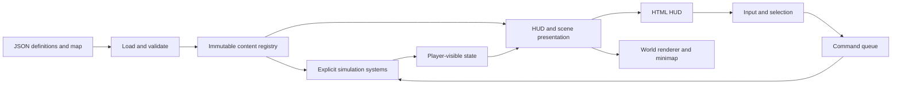

# Declaration rebuild: review specification

**Status:** Design for review. No game implementation changes yet.  
**Date:** 8 September 2026.  
**Companion:** [Production and work](</Users/jiritrecak/Documents/Supernova/Development/Settlers 3 Web/production-and-work-spec.md>).

**Scenario review:** [Findings and acceptance cases](</Users/jiritrecak/Documents/Supernova/Development/Settlers 3 Web/declaration-scenario-review.md>). The clarifications from that review are incorporated below as proposed implementation contracts, not claims about the current engine.

This specification supersedes the implementation approach in `declaration-proposal.md`. That document remains a record of the first discussion; where it differs, use this specification and its companion.

## 1. Decisions now settled

We will replace the current gameplay/content integration in **one complete cutover**. We will not ship compatibility adapters, support old map/save formats, retain duplicate rule tables, or keep two implementations of the same mechanic.

The current content set is small enough to rebuild coherently: settlers, warriors, archers, wolves, ogres, the existing buildings, physical goods, resources, territory, fog, and their editor/HUD integration. The review should settle the contracts first; implementation can then replace the whole affected layer against those contracts.

The architectural choices are:

- **JSON is the editable source of truth.** Definitions load through schemas and cross-reference validation. TypeScript implements systems and derives its content types from those schemas.
- **Behavior composition supplies capabilities and commands.** No universal unit/building inheritance tree and no behavior programming language.
- **Algorithms are engine code.** Movement accepts a destination and unit properties such as speed. Content cannot choose A*, heuristic weights, scheduler ordering, or pathfinding internals.
- **Every gameplay entity has an owner**, including an explicit `none`. Ownership, direct control, and hostility are separate, small concepts.
- **Command cards sort by priority.** Higher priority fills earlier cells, starting at the top-right. No fixed per-unit slot layouts.
- **The target owns its creation cost.** A barracks lists producible unit IDs; each unit declares its own inputs and work requirement.
- **Workers perform jobs.** “Lumberjack” describes a settler's assignment. We do not need a separate lumberjack unit definition or a configurable lumberjack algorithm.
- **HTML remains the HUD.** The renderer consumes presentation data. Live portraits and a WebGL HUD are out of scope now.
- **No Lua implementation now.** The command boundary and state model should make a future adapter straightforward.
- **Balance values are provisional.** There is no compatibility requirement for today's numbers or incidental behavior.

A cutover can contain ordinary implementation steps and tests. It does not require writing everything in one file or one commit. The finished game must have one path for each operation.

## 2. The simple mental model

An entity has four relevant things:

1. A **definition ID**: what it is.
2. An **owner**: who it belongs to, or `none`.
3. **Runtime state**: position, HP, orders, inventory, job, and other applicable state.
4. A resolved set of **capabilities**: what the engine can do with it.

Its definition supplies stats, appearance references, capabilities, and any creation requirement. Systems use that data to run the game. Presentation reads the player-visible result.



There is no instruction interpreter hidden inside the registry. A new unit using existing capabilities should be data-only. A new mechanic requires engine implementation.

## 3. Content files and loading

### 3.1 Content categories

Use these categories initially:

```text
content/
  units/          Ant settlers, warriors, archers, neutral creatures
  buildings/      Fort, barracks, economic buildings, house, tower
  items/          Logs, planks, stone
  resources/      Harvestable trees and stone deposits
  behavior-sets/  A few reusable capability bundles
  actions.json    Names, icons, priorities, hotkeys for known command types
  rules.json      Match setup, diplomacy, combat balance and shared limits
  assets.json     Stable asset IDs mapped to model/icon files
maps/
  ant-colony-compare.json
  mosswater-divide.json
```

The filenames/extension are proposed organization. JSON map contents matter more than whether we retain the `.utcmap` extension. Use one definition per file for units/buildings/items/resources so editing a warrior does not involve the entire game catalogue. Use explicit IDs, not filesystem order.

IDs follow the user's proposed convention:

- `unit.ants.warrior`
- `building.ants.barracks`
- `item.plank`
- `resource.forest.tree`

A definition ID is not a model path, translated name, or runtime entity ID. Replacing art cannot change what an entity does.

### 3.2 Load once, reject mistakes early

The loader:

1. Parses JSON against strict schemas.
2. Rejects unknown fields, invalid values, duplicate IDs, and unknown behavior/action names.
3. Resolves references, expands behavior sets, and validates combinations.
4. Checks production inputs/outputs and map ownership/placements.
5. Builds indexed immutable definitions and a content fingerprint.

Systems consume this registry. They do not read files, parse JSON each tick, or repeatedly look up arbitrary property paths.

Schemas are the single shape contract: infer TypeScript types from them and use the same validation for editor saves and game loads. Do not maintain handwritten interfaces that can drift away from the JSON validator. There are no callbacks, formulas evaluated as code, or engine class names in JSON.

Editor content fields write back to the same JSON definitions. Map fields write to map JSON. Editing an instance's initial HP does not secretly change the unit type's maximum HP. Existing asset/terrain editor controls can be reused, but they must read/write this new contract directly.

Content editing is an authoring operation. Matches use a frozen registry from their start. Reloading edited content starts a new simulation; it does not mutate a multiplayer match halfway through.

Validation errors identify the file, definition/placement ID, and field. An editor save validates the entire affected reference graph before replacing committed content; changing a warrior to require iron must also update accepting producers before that content revision can play. Draft edits may remain in the editor, but a failed save cannot leave half of a content revision on disk. Loading is strict: missing references are errors, never silent substitutions.

## 4. Entity definitions and behaviors

### 4.1 Use a small vocabulary

Do not create a behavior for every property. Name, model, armor type, maximum HP, and vision radius can be fields. Behaviors are meaningful bundles of activity or permission.

Initial capabilities should cover:

- **Movement:** can travel; speed is tunable.
- **Player control:** can accept direct orders from its owner.
- **Combat:** attacks and autonomous target acquisition.
- **Work:** can accept economic jobs and carry materials.
- **Production:** a workplace can create its listed outputs.
- **Storage:** can hold goods and receive permitted deliveries.
- **Territory:** contributes owned buildable area.
- **Camp defense:** engages nearby players and returns home.

Units and buildings have a body with health and defense. Resources and ground items need not have HP. Normal battlefield entities are inspectable by default when observed; `selectable: false` is an intentional exception. Do not make authors attach ten boilerplate components before an item can show its name.

Storage is a capability with inventory state; a warehouse needs it without producing anything. Work and production have separate state because a worker and its workplace are different entities. Identity/classification fields do not determine algorithms.

### 4.2 JSON example: warrior

Examples in these documents are proposed schema instances. Referenced behavior sets and assets would be supplied by the approved implementation.

```json
{
  "id": "unit.ants.warrior",
  "kind": "unit",
  "name": "Warrior",
  "description": "Armored ant infantry. Protects the colony and fights at close range.",
  "asset": "asset.ants.warrior",
  "icon": "icon.ants.warrior",
  "selectionClass": "army",
  "body": {
    "maxHp": 120,
    "armor": 2,
    "armorType": "light"
  },
  "behaviorSets": ["behavior-set.ground-army"],
  "behaviors": {
    "combat": {
      "damage": 12,
      "damageType": "physical",
      "range": 1.5,
      "cooldownTicks": 32,
      "aggroRange": 10
    }
  },
  "creation": {
    "method": "recruit",
    "items": [{ "item": "item.plank", "amount": 1 }],
    "unitInput": "unit.ants.settler",
    "workTicks": 160
  }
}
```

`ground-army` supplies movement, player control, and common combat defaults. The resolved archer has the same capabilities with different body/combat values. Neither declares a Move button.

Behavior sets are **flat reusable bundles**, not an inheritance hierarchy. Do not allow behavior sets to reference other sets initially. Multiple conflicting defaults require an explicit field override in the entity. Arrays replace completely; scalar object fields merge according to the known schema. The resolved definition can always be displayed in the editor.

An entity may list `disabledBehaviors` to remove a capability supplied by a set. This is an authoring operation, resolved before Play. The validator rejects contradictions such as a disabled movement capability still required by another enabled capability.

For runtime changes now, keep only the concrete locks our jobs need, such as a recruit being unavailable during training. Do not build a general system for equippable capability grants, modifiers, or suppression graphs before a mechanic needs it.

### 4.3 Command contribution is derived

The engine knows that:

- Movement + player control exposes Move and Stop.
- Combat + player control exposes Attack.
- Work + player control exposes the permitted construction actions.
- Queued production + player control exposes Produce and queue management.
- Production + player control exposes Pause/Resume; unit-producing workplaces also expose Rally.
- A construction site + player control exposes Cancel Construction.

These rules are code shared by command discovery and authorization. JSON configures capabilities and the known action metadata. Removing player control hides direct orders **and makes direct player requests illegal**. Autonomous systems can still move/fight. A button is never the authority check.

This applies to **buildings as well as units**. Authored player buildings declare player control directly or through a shared behavior set. Every direct command also checks requester ownership. There is no implicit permission granted by `kind: building`. A site exposes inspection and cancellation, but completed-building production, normal storage, and territory capabilities remain inactive until construction completes. Cancel Construction never demolishes a completed building.

The Work capability references a flat `builds` list of building definition IDs, normally supplied by a shared worker behavior set. That is the build catalogue for both UI discovery and command validation. Buildings do not register themselves globally as buildable by every worker. Stop cancels an explicit order and abandons uncommitted work; existing cargo is settled. It then returns the unit to its normal autonomous behavior, including idle combat acquisition or economic assignment. Stop is not a permanent disable switch. Pause/Resume belongs to workplace production and is described in the companion.

The movement system does not depend on player control. That distinction lets a neutral wolf walk, a settler perform work, and a future script order an uncontrolled actor through a trusted API.

### 4.4 Heroes and items stay ordinary

A hero is a unit with `hero: true`. That can affect labeling/selection decoration. It does not automatically create an inventory, leveling system, revival, or special networking.

Inventory and abilities can be added as actual capabilities when needed. A future non-hero can also carry items. For now, ground items can be selected and described without any hero implementation.

## 5. Ownership, control, and hostility

### 5.1 One owner field everywhere

Every gameplay entity has:

```json
{ "owner": "player.1" }
```

or:

```json
{ "owner": "none" }
```

This applies to units, buildings, interactive resources, and loose items. Decorative foliage/decals are scenery and need no gameplay owner. A harvestable tree is a resource entity even if visually rendered in the same tree batch as scenery.

The definition does not fix ownership. The map, match setup, production result, or an authorized simulation operation assigns it. Producing a warrior gives it its producer's owner. Owner color drives visual tint; there is no separate red-warrior gameplay definition.

### 5.2 Three distinct questions, no large diplomacy framework

- **Ownership:** which player owns this entity, or none?
- **Control:** may this requester issue this command? For a player, ownership and the required control capability must both allow it.
- **Hostility:** should this actor automatically fight that target?

Player records select human/AI control and a team. Team relations determine hostility between players. A neutral camp has a small explicit aggression policy, initially `players` or `passive`. `none` alone must not mean hostile: a neutral shop and a wolf camp can both be unowned.

Aggressive camps attack player-owned targets, ignore other unowned creatures, and obey their leash. Player armies treat an aggressive neutral as a hostile target. Passive unowned entities are inspectable; explicit forced attacks still obey damageability rules. Allied entities are never automatic targets, while A + target can deliberately force friendly fire. Self-attack is rejected.

We do not need separate per-entity controller objects, arbitrary relationship scripts, or a diplomacy editor now. AI is a producer of commands for a player; camp defense is a native autonomous system. A future ownership-change operation updates control eligibility, targeting, jobs, territory, and color together.

There is **no live capture/ownership-change mechanic in this cutover**. Editor owner changes occur before Play. If capture is added later, it must be an atomic native operation; writing `owner` alone is not a supported command. Unowned entities share neither an economic workforce nor a colony warehouse merely because they all use `none`.

## 6. Map declarations

Maps reference definitions and own instance placement/state:

```json
{
  "id": "mosswater-p1-barracks",
  "definition": "building.ants.barracks",
  "position": { "x": 210, "y": 202 },
  "rotation": 0,
  "owner": "player.1",
  "initialState": { "construction": "complete" }
}
```

Here `x,y` are the two map-plane coordinates. Elevation comes from terrain; rotation is degrees around the up axis. Rendering converts this explicitly to its world X/Z convention. No reused field with two coordinate meanings.

There are three identities:

- `definition`: reusable content identity.
- Placement `id`: persistent authored identity within this map.
- Runtime entity ID: simulation identity allocated in a deterministic order.

The runtime keeps the placement-to-entity mapping. Future scenario code can refer to `mosswater-p1-barracks` without depending on where it happened to appear in an entity array.

Maps also declare starts, initial setup, camps, regions where needed, terrain, scenery, and environment. Startup entries and explicit placements have one authority: no hidden constructor that spawns another fort behind the map's back. A normal player start references an explicit setup containing the fort, settlers, initial warriors, and starting goods; authored extra entities are separate placements. Validation catches overlapping setup/placements.

Setup members have stable local IDs. Expanding a start creates deterministic authored keys such as `start.player.1/main-fort`; the skirmish objective refers to that key. Extra forts are ordinary buildings unless explicitly bound as the main fort. Each skirmish player must have exactly one living, completed main fort binding, a valid start/setup, and a reachable initial deployment area. Initial stock must fit the declared starting stores; setup cannot inject 70 goods into a 16-capacity fort. New maps create the required starts, and validation prevents deleting a required objective binding without replacing it. Singleplayer lists saved playable maps; Play/export of an invalid skirmish draft is rejected with a specific authoring error.

Allowed `initialState` fields are deliberately small and kind-specific: starting health, construction completion, resource amount, starting inventory, and loose-item `quantity` where applicable. A placed loose stack has positive integer quantity up to its item's `stackLimit`; larger cancellation returns create multiple stable-ID stacks. Health and resource amounts must be within their declared bounds, and initial inventory must respect storage's legal contents and capacity. No arbitrary overrides of behavior code or creation prices. To change a unit type globally, edit its definition; to make a distinct type, create a definition.

Camp records group explicit members and define their home area/aggression. Wolf/ogre entries use unit definitions; resource entries use resource definitions. Asset names no longer decide which stamps secretly become gameplay entities.

Camp members must be unowned units with camp-defense capability, and a member belongs to at most one camp. A neutral-defense unit requires a camp home/policy; the editor's ordinary neutral-placement action writes a one-member camp alongside the placement, or adds it to a selected camp. Runtime loading does not invent camps from model names. Player-owned wolf variants can use ordinary combat without camp defense. Pure art variants of a tree remain presentations of the same resource definition, so choosing another tree mesh does not silently make it unharvestable.

The editor uses the same definitions for Units, Buildings, Items, and Resources. Selection, move, rotate, delete, undo, and save all operate on map records. Previewing a different model never changes simulation semantics.

We will author the two retained maps directly into the new format. There is no runtime old-map converter, format alias, or fallback loader. Player 1 and Player 2 starts remain required for playable skirmish maps.

## 7. Command priorities and interaction

### 7.1 Priority is a presentation rule

`actions.json` supplies metadata for engine-supported actions:

```json
{
  "move": { "name": "Move", "icon": "icon.move", "priority": 100, "hotkey": "M" },
  "attack": { "name": "Attack", "icon": "icon.attack", "priority": 90, "hotkey": "A" },
  "stop": { "name": "Stop", "icon": "icon.stop", "priority": 80, "hotkey": "S" },
  "produce": { "name": "Produce", "icon": "icon.produce", "priority": 60 }
}
```

Actions configure known operations. Adding an unknown action name does not install a new algorithm. Command bindings such as Produce Warrior resolve their title/icon/description/cost from the target definition.

Resolution:

1. Apply the selection aggregation policy below, then gather actions supplied by those entities' capabilities and ownership.
2. Deduplicate identical bindings, including their target definition argument.
3. Compute enabled/disabled state and applicable actor subset.
4. Sort descending by priority; ties sort by stable binding ID using ordinal comparison.
5. Fill cells in order. Unused trailing cells are empty.

Recommended initial grid: four columns, three rows. Position 1 is **top-right**, then progress right-to-left and down:

```text
 4   3   2   1
 8   7   6   5
12  11  10   9
```

Move 100 and Attack 90 occupy positions 1 and 2. Changing priorities reorders every applicable card automatically. An optional central binding override can give `produce:unit.ants.warrior` a priority different from another produced unit without copying command lists into buildings.

Unavailable actions stay disabled in their sorted position. Removing a capability removes the action and compacts the list. More actions use the next page in the same sort order; page navigation sits outside the action cells. No pinned slots or per-unit layout declarations.

Priority affects **display order only**. It cannot decide command execution order, combat targeting, job assignment, or whether clicking an enemy means Move or Attack.

### 7.2 Keep selection and controls explicit

The interaction service owns local selection, primary selected entity, and targeting mode. HTML displays them; the simulation receives concrete requests.

- Drag selection prioritizes owned army units; without army, selects owned workers.
- Shift adds/removes selections. Cards can isolate or remove members.
- Left-click ground moves eligible selected units; clicking an own entity selects it.
- Clicking a hostile entity with army selected attacks it.
- A + ground attack-moves combatants; A + a visible damageable entity explicitly forces attack, including friendlies.
- Arrow keys pan; WASD does not pan. Existing wheel zoom/drag-pan remain local.
- Escape cancels targeting. It does not silently send Stop.

A mixed group's Move applies to all eligible movers; Attack applies only to combatants and leaves others alone. Produce applies once at the primary selected eligible producer. Build creates one project through an eligible selected worker. This avoids unintentionally training five warriors or placing five buildings with one click.

For unit orders, the card uses the union of supported bindings and displays the applicable count, such as "Attack · 3 of 5". Area-selection priority considers directly controllable, uncontained units; an uncommandable army statue cannot exclude workers from a drag selection. Inspecting an enemy or uncontrolled actor is still allowed when visible.

For building selection, **workplace commands, queue, stock, and status all refer to the same focused building**. Selecting two barracks does not merge their queues. A command available only on a secondary workplace is not exposed until that workplace is focused. For mixed building/unit selection, a focused building shows its workplace card; a focused unit shows the selected units' group card. Build uses the primary eligible selected worker, falling back to the lowest eligible entity ID, and the emitted request names that worker. Neither focus nor camera state is consulted by the simulation.

Contextual click rules are engine-owned interaction rules. They do not change because a modder raises the visual priority of Move. Hotkeys activate semantic actions rather than cell numbers. Validate conflicts among simultaneously available actions; contextual targeting is cancelled/revalidated when selection changes.

Move/Attack/Stop have global semantic hotkeys. Generated Build/Produce bindings have no shortcut unless explicitly assigned in central metadata. Initial validation conservatively requires those optional shortcuts to be unique across the command catalogue and not collide with reserved controls; an impossible combination is preferable to a key silently choosing the wrong action. Only actions on the active card page respond to generated shortcuts. Search/typing in a text field suspends gameplay hotkeys. There is no algorithm that derives shortcuts from translated names.

## 8. Commands, orders, and system authority

A command is a requested intention. An order is the accepted ongoing activity. A job is an internally assigned economic activity. Damage and production completion are system effects, not player-supplied commands.

An illustrative request:

```json
{
  "type": "produce",
  "actors": [104],
  "targetDefinition": "unit.ants.warrior"
}
```

The queue envelope supplies authenticated requester, tick, and sequence. Requests never supply their own cost, damage, ownership, or authority level. Command execution checks actor existence, ownership/control, capability, allowed production targets, current state, and target validity.

UI queries use the same definitions to explain availability, but execution revalidates when the request is applied. A stale enabled button is not a guarantee of acceptance. An accepted production queue entry can legitimately wait for delivery or a recruit.

All **external gameplay intentions** enter the command queue. Do not interpret “everything is a command” as sending a network command for each movement step, HP decrement, or automatic carrier decision. Those are deterministic internal transitions. Local selection, camera movement, and tooltip events do not enter lockstep.

Stable order/queue IDs identify cancellation targets. Do not cancel “entry 0,” which may have changed before the request arrives.

Group requests contain a deduplicated, canonically sorted list of runtime actor IDs. Reject malformed payloads and requests naming another player's extant actors. For an otherwise authorized group order, stale/dead or newly ineligible members are skipped with a result explaining the affected subset; surviving movers can still receive a movement order. Build/Produce/Cancel refer to a single resolved actor or queue ID and either commit once or reject with no partial charge. An empty eligible set produces a failure result, not a successful no-op. A rejected request is still processed in the same lockstep position on every peer.

## 9. System notes: explicit algorithms, narrow responsibilities

These are logical responsibilities, not an obligation to create a plugin framework or one class per paragraph.

### Content and initialization

Owns validation, immutable resolved definitions, indexes, and deterministic map/setup instantiation. No fallback content or model-name gameplay inference.

### Entity lifecycle and health

Owns identity, HP, defense, creation, transformation, death, and removal. Units/buildings use one damage path. Death happens once and releases jobs, cargo/reservations, occupancy, and vision. A fort's loss is interpreted by the match objective, not every object's damage function.

Health, armor amount/type, and damage type are balance fields. The damage algorithm is code; an armor interaction matrix can be data. Start with a small clear formula, not an editable arithmetic graph. Heroes use the same health path.

Initial formula: apply the damage-type/armor-type integer permille multiplier to base damage, round down, subtract flat armor, then clamp a non-immune hit to at least 1. A zero multiplier means immunity and produces 0. HP, damage, armor, work, quantities, and cooldowns use validated integer values; authored positions/speeds/ranges compile to the engine's fixed spatial precision. No damage or movement amount comes from render-frame time.

### Navigation and movement

Owns walkability, route search, deterministic destination assignment, collision avoidance, and movement steps. Input is destination plus legitimate unit properties such as speed/footprint. Its algorithm, search order, replanning strategy, and implementation budgets are not JSON options. Pathfinding has no author-facing “behavior.”

### Orders and work arbitration

Owns which activity controls movement/work at a time. Combat pursuit, direct movement, harvesting, and deliveries cannot all move the same actor independently. Training locks a recruit; employment assigns specialists; unassigned eligible settlers carry. Rules for interruption and cargo settlement are fixed engine semantics documented in the companion.

### Combat and camps

Owns acquisition, pursuit, attack timing, range/target checks, damage requests, and camp return. Data supplies combat stats and sensible camp balance such as aggro/leash distances. Code owns the search/scheduling algorithms. Cosmetic arrows/animations do not decide hits. Neutral hostility is explicit, not inferred from `none` ownership alone.

Attack-move retains its ground destination while fighting a currently perceived relevant target, and resumes when that engagement ends. Direct target pursuit ends on loss of sight; it cannot track a hidden unit by its live coordinates. Forced attack bypasses friendliness, not visibility, self-target, damageability, or range checks. Neutral perception is a native local range query; it does not depend on a human player's fog. Camp members return to their own authored home after exceeding their leash and do not acquire targets while returning. No neutral healing, respawn, or loot is introduced by that return.

### Economy and construction

Owns physical inventory, reservations, delivery, production, recruitment, construction, harvesting, and planting. Buildings advertise capabilities and output IDs; targets own costs. See the companion for exact records and lifecycle rules. There is no switch on `building.ants.lumberjack`. Dispatching to a known harvest/craft/recruit processor is appropriate engine logic; we are removing branches based on content identity, not forbidding conditional code.

### Territory, visibility, and objectives

Owns owned buildable area, real border geometry, sight, exploration memory, and match outcome. Territory radius/vision are tunable gameplay data; flood/range algorithms are code. Preserve the three fog states and never derive territorial borders from the explored-region boundary. The match objective links each player's main fort to defeat; forts need no defensive fire.

The placement footprint must lie in owned buildable territory when a project is admitted. Losing that territory later does not transfer, delete, or cancel an existing building/project; it prevents new placement there. Workers remain legal owners of their delivered materials. Harvesting/planting additionally checks the site's work eligibility when starting a new extraction/planting cycle. Extracted cargo still belongs to the extracting player even though the resource site normally has owner `none`.

### Observation and presentation

Owns what can be inspected and how to describe it. Units, buildings, resources, and ground items use one observation/selection contract. Enemy private queues/jobs/inventory are not revealed merely because a model is visible. Remembered buildings expose last-known public information, not live activity.

Unknown cells show darkness; explored cells show remembered terrain/environment; currently visible cells show live public state. Moving enemies and enemy loose items disappear from inspection when unseen. Static building/resource memories retain only last-observed facts until seen again. Reducing a remembered building's live HP or felling a hidden tree cannot update its memory. Draw border fragments from actual territorial edges observed there, or their last-known edge samples; never close a contour along the boundary of explored cells. Old visible selections/tooltips lose their live reference when observation changes.

An entity-target command must name a currently visible target; a last-known building can instead be approached by a ground order. Placement requires an explored, buildable footprint but checks authoritative occupancy, so a hidden blocker yields only a generic placement failure, never its identity/owner/HP. These are gameplay visibility rules, not anti-cheat secrecy: ordinary lockstep peers still hold authoritative world state locally.

### Renderer and HTML HUD

Owns visual assets, player tint, scene objects, selection feedback, minimap drawing, cards, tooltips, and layout. It receives IDs and view data, not live simulation objects. No role-specific command construction or asset-name logic. HUD remains capped at 1200 px; icons/static portraits are sufficient now. Render resolution and debug settings remain local preferences.

### AI

Owns decisions for an AI-controlled player and sends the same validated commands as player input. It discovers legal producers and build targets through the registry rather than inventing prices or writing directly to inventories. Retain a basic economy/recruitment opponent for the rebuilt match; do not add a configurable AI programming language. Content references in a faction build set are legitimate data, while per-building algorithm branches are not.

### Match runtime

Owns the fixed tick, command ordering, checksums, snapshots, and network transport. Definitions do not control its schedule. Existing lockstep and navigation implementations may be reused after adapting their boundaries; cleanliness does not require replacing a good algorithm with another copy. Use explicit typed snapshots for state that affects future ticks, including orders, reservations, counters, queues, and fog memories. Support the new format only.

Use the following fixed phase contract for the rebuild:

1. Apply the tick's committed external commands in canonical order, using the previous completed tick's observation for request visibility.
2. Resolve current work/order claims and advance movement.
3. Refresh current perception, collect eligible attacks, then apply their damage batch and death cleanup. Attacks eligible in this batch resolve simultaneously; entity iteration order must not decide a mutual kill.
4. Advance surviving economic jobs, deliveries, production, resource growth, and repair. Dead producers cannot complete a cycle or be repaired back to life. New outputs become eligible for work/combat on the next tick.
5. Recompute affected territory/visibility, update memories, evaluate objectives, and publish the tick result/checksum. Both bound forts dying in one tick is a draw. An ended match accepts no further gameplay commands.

Within each phase, ties use stable IDs and documented native rules. Allocation is independent of JSON key order, file discovery order, asset loading, and render cadence. Instantiate expanded map placements in ordinal authored-ID order; store next entity/job/queue counters and seeded RNG state. AI runs deterministically from its permitted player observation and submits future-tick commands through the same authoritative ingress; there is one committed command stream, not one extra AI submission per peer.

Snapshots are captured only at a completed tick boundary. Store authoritative active routes or all state needed to reproduce them exactly, reservations/claims, contained recruits, pending movement, active work, growth timers, objective bindings, AI state, and per-player memories. Do not serialize a HUD/observation view as the save world. The transport separately preserves committed but unapplied commands and sequence progress, so restore neither drops nor replays an accepted order twice. Derived indexes can be rebuilt only if doing so preserves subsequent decisions. Match/save loads require the current schema plus matching canonical content, map, and simulation-build identities; no fallback loader or patching a changed ruleset into a running match.

### Performance

Keep the current fixed 40 Hz simulation independent of display FPS. Resolve content once, update capability/command caches on relevant changes, and use spatial queries for nearby targets/jobs. Decorative foliage remains batched graphics data. Expose timing for navigation, combat, logistics, observation/HUD, and rendering through debug mode so the replacement can be compared at representative map/army sizes. JSON declarations must not become per-frame parsing or a reflective interpreter.

## 10. Scope of the replacement

The completed replacement must run a whole match, not just a barracks example:

- Starting fort, settlers, and initial warriors.
- Every current building's purpose: storage/territory, housing, harvesting, sawmill production, planting, construction/repair, and recruitment.
- Logs, planks, stone, physical carrying, and visible stacks.
- Warriors, archers, wolves, ogres, combat HP, and neutral camps.
- Ownership, army/worker selection, movement, attack-move, forced attack, and command priorities.
- Territory and three-state fog with correct remembered information.
- The two authored maps, editor placements/ownership fields, map loading, and new JSON content editing.
- HTML HUD/status/tooltips/minimap driven by the new model.
- Deterministic multiplayer behavior and performance diagnostics.

Numbers can be tuned together as we implement. Keep prices, work durations, stats, capacities, and starting stock in JSON. We do not need historical numerical equivalence tests.

The following are **not** part of this replacement: Lua, live portraits, a WebGL HUD, hero progression/inventory, loot tables, new factions' movement mechanics, arbitrary scripted behaviors, or general mod package distribution.

Future capability should come from clean boundaries, not from implementing all future features now.

## 11. One cutover and a clear deletion rule

Review these specifications, implement the replacement in the working branch, then switch the game/editor to it and remove the old paths before considering the work complete. Development may temporarily have unfinished modules, but the release boundary must contain one registry, one command dispatcher, one simulation path per mechanic, and one presentation contract.

Delete/replace:

- The old gameplay rule tables and aliases such as wood meaning planks.
- Type-specific job/command/model decisions scattered through HUD, session, and rendering.
- Gameplay inferred from resource/neutral model filenames.
- Old action payloads and old map/save loaders.
- Duplicate old/new data fixtures and tests that only preserve obsolete implementation details.

Keep/reuse where sound:

- Asset files, shaders, batching, terrain rendering, player-material tinting.
- Proven pathfinding, lockstep transport, camera input primitives, and editor interactions.
- Tests of intended game behavior and determinism, rewritten against the new contracts.

The new schema has one supported version. Old maps/saves are not loaded. Reauthor the retained map documents directly and invalidate stale local match data clearly. Keep a current content fingerprint for multiplayer agreement; that is correctness, not a backwards-compatibility layer.

## 12. Queue boundary now, Lua later

Yes: a programmatic command queue is the central entry point a future Lua adapter needs. It lets a script request “move this actor” or “spawn this declared entity” without coupling to HTML or simulation internals.

It is not quite the whole scripting contract. Later Lua also needs read-only queries, event subscriptions, simulation-time timers, explicit persistent state, and trusted permissions for operations such as spawning. Those must be deterministic and saveable. We should not build those adapters now.

For this rewrite, retain only the foundations that are already useful:

- Typed commands with authenticated source context.
- Stable entity/placement IDs.
- Explicit serializable game state and deterministic tick ordering.
- Structured result/fact records for existing actions and lifecycle events.
- A simulation with no browser or renderer dependency.

No Lua library, interpreter-selection work, coroutine persistence, generic trigger editor, or privileged spawn action exposed to ordinary network clients. Later, the host can give scripts a trusted adapter to engine operations; a client must not self-declare itself a scenario script.

## 13. Completion criteria

The architecture is clean when these demonstrations work:

1. Add a new warrior variant in JSON with existing behaviors and art; gameplay, selection, HP, commands, and tooltips work without new type branches.
2. Change the warrior's price in its JSON; every barracks, queue tooltip, validator, and logistics request uses that price.
3. Change Move/Attack priorities centrally; all relevant cards reorder from the top-right.
4. Remove player control from a unit; direct orders disappear and are rejected, while native autonomous movement remains possible.
5. Place a unit/building/item with owner `none` or a player in the editor and reload the map with identical authored state.
6. A settler changes from carrying to harvesting to recruitment without profession-specific entity types or duplicated goods.
7. A mixed selection moves/attacks only through eligible capabilities; no renderer checks a warrior string.
8. Replay equal commands on independent simulations and obtain equal results/checksums. Presentation cadence and resolution do not change outcomes.
9. All current game/editor entry points use the new contract; obsolete loaders, aliases, and rule paths are gone.

**The implementation milestone is a complete Mosswater match using only the new declarations and systems.** The barracks remains a useful test case, but it is not the scope boundary.
