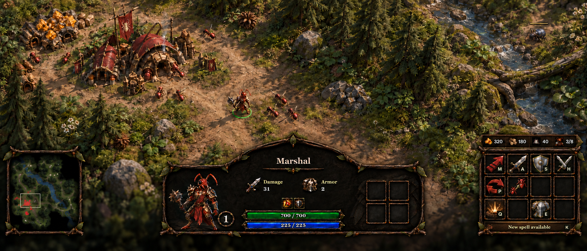

# Woodland HUD

The Vanguard interface uses three independent islands: a square minimap at the left edge, a shaped selection panel in the middle, and commands at the right edge. Thin twigs, muted leaves, dark bark and quiet leather carry the faction identity. Text, items and orders remain live HTML controls.

## Layout and content

Settings → HUD layout selects **Spread** or **Compact**. Spread anchors map and commands at the edges of the viewport. Compact centers the same modules within 1,240 CSS pixels. The preference is local, persistent and shared by campaign and skirmish; it never enters the synchronized simulation.

The selection panel has low wings and a higher center. The left wing displays the actual selected 3D model, lit independently against a dark background. A hero has a small level badge and experience strip. Name and combat stats occupy the middle. Status icons sit immediately above numbered HP and MP bars. Buildings show armor and HP, with the current operation replacing the mana row. The right wing contains four inventory slots or a queue of up to five waiting operations. There is no duplicate icon for the active task.

Inventory size remains declared by `behaviors.inventory.slots`: the Marshal now has four. Default inventory shortcuts are Num 7, 8, 4 and 5, matching the 2×2 arrangement. Barracks and siege recruitment allow six total orders: one current/waiting-for-worker order plus five pending orders. Other workplace queue limits remain content-defined. Cancellation still submits the existing authoritative cancel/refund action.

Commands remain one declarative 4×3 grid. Movement and combat controls occupy the upper rows. Learned abilities keep their authored bottom-row columns, even when neighboring abilities have not been learned. The full-width New spell available banner is row four. Every slot owns its own frame; there are no painted grid lines to drift away from the buttons.

## Rendering boundaries

- `src/ui/settlement/settlementHud.ts` consumes the observation and command presentation models. It does not read mutable simulation entities.
- `src/presentation/workplace.ts` separates active work from pending work for training, research, revival and upgrades, and suppresses remembered production.
- `src/ui/settlement/commandDock.css` owns island layout, framing and bars. `src/shared/settings/hud.ts` owns the layout preference.
- `src/render/portrait/selectionPortrait.ts` draws a small scissored pass through the **existing WebGL renderer**, after the battlefield. Its bounds are computed on model change; camera fitting updates only when its viewport changes. It uses cached assets and an independent skeleton/material instance, with no duplicate geometry, second WebGL context, readback or render-target copy.
- Portrait passes are included in the existing GPU timing and draw/triangle counters. Their resources are disposed on selection replacement and scene teardown. Hidden/cinematic HUDs skip the portrait pass.
- The model viewport is a transparent cutout in the panel backing. The icon remains an automatic fallback if a selected asset has no loaded model prototype.

## Tactical map

The minimap is a 384×384 Canvas2D raster, independent of display pixel ratio. It presents the actual map rather than an illustration substituted for it:

- Warm, lightly grained land with directional elevation and cliff shading.
- Muted green cover, roads and surface paint from the authored landscape.
- Pale blue-green shallows grading into deep slate-blue water.
- Small shaded canopies for forest clumps and pale rock silhouettes.
- Bright player markers, yellow Amber and lavender Root deposits, with a outlined ivory camera footprint.

Terrain is cached until terrain or paint changes. Scenery has a separate cache, so tree removal does not resample the entire height field. Fog and observation-filtered entity markers are composited afterward. Normal visibility, remembered structures, editor starts, minimap dragging and minimap commands keep their existing contracts. Visual reveal in debug does not give the AI new information.

## Artwork

Reusable runtime textures live in `assets/ui/woodland`; generation prompts and provenance are saved there. The minimap frame is also sliced into understated resource/banner borders. Selection is 1,440×480, the map frame 512², the satchel 256², and the shared slot 128². Artwork is never regenerated during play.

The generated wide selection backing included a checkerboard outside its silhouette. The two SVG masks deliberately exclude that area; the portrait variant also cuts the model viewport out of the backing. Keep masks aligned with the texture when changing the silhouette. The approved full composition is documentation only, not loaded by gameplay.

## Verification

Browser checks cover campaign and skirmish, live unit/building models, four inventory slots, ability learning and its return to the root card, fixed ability columns, compact mode, and debug map reveal. Presentation tests cover active versus pending tasks, cancellation identity, remembered buildings, resource markers and terrain palette behavior. The simulation inventory/drop tests use the declared slot count.
